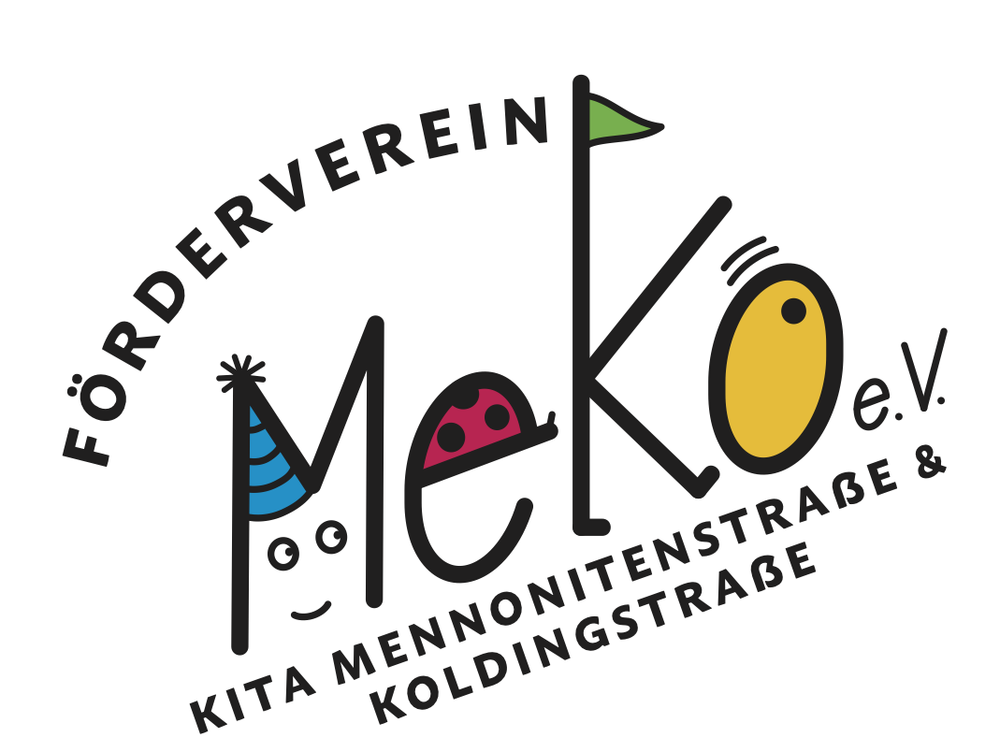

Liebe Eltern,
liebe Interessierte,

wir freuen uns, euch den Förderverein MeKo e.V. vorzustellen, den wir Eltern für die Kita Mennonitenstraße und Koldingstraße ins Leben gerufen haben. Unser Ziel ist es, die Spiel- und Lernbedingungen in den Kitas kontinuierlich zu verbessern. 

Dank eurer Mitgliedsbeiträge können wir Spielzeug und Bildungsmaterialien finanzieren, die den Kindern in der Kita zugutekommen.

Wir setzen uns dafür ein, dass die Kinder in einer inspirierenden Umgebung lernen und spielen können.

Wir freuen uns über jedes Engagement und jede Unterstützung. Gemeinsam können wir die Kita zu einem noch besseren Ort für unsere Kinder machen.

[Flyer](MeKo_Flyer_06dr.pdf)

## Impressum

Förderverein MeKo e.V.
Mennonitenstr. 5
22769 Hamburg

E-Mail: info@foerderverein-meko.de

Gemeinschaftlich
vertretungsberechtigt: 

Erste Vorsitzende:

Jennifer Maiwald

c/o Förderverein MeKo e.V.

Mennonitenstr. 5

22769 Hamburg

E-Mail: info@foerderverein-meko.de

Zweite Vorsitzende:

Katharina von Huene

c/o Förderverein MeKo e.V.

Mennonitenstr. 5

22769 Hamburg

E-Mail: info@foerderverein-meko.de

Schatzmeister:

Malte Klemm

c/o Förderverein MeKo e.V.

Mennonitenstr. 5

22769 Hamburg

E-Mail: info@foerderverein-meko.de

Registergericht: Amtsgericht Hamburg

Registernummer: VR 25312

V.i.S.d § 18 Abs. 2 MStV

Malte Klemm

c/o Förderverein MeKo e.V.

Mennonitenstr. 5

22769 Hamburg
